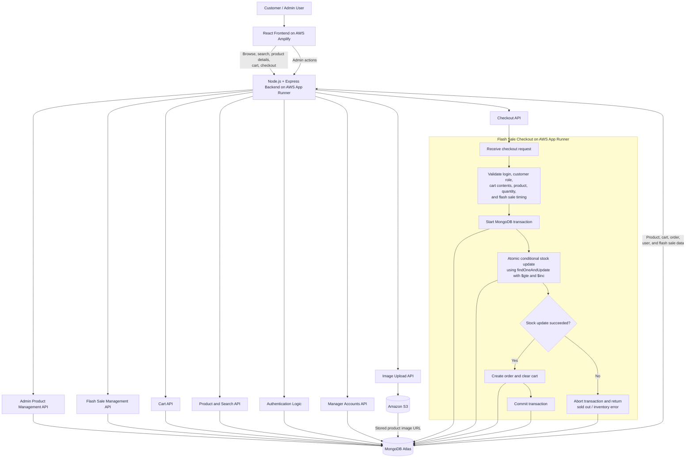

# GadgetHub Report Document Changes

This file summarizes the report edits to make based on the current implementation and the testing results discussed.

## 1. Section numbering to fix

- The testing sections in the document body are `5.1 Initial Testing` and `5.2 Report on Final Testing`, not `7.1` and `7.2`.
- Keep the document references consistent with the actual section numbers.

## 2. Replace Figure 3

Replace the current `Figure 3. Final Solution Flow Diagram` with a version that matches the actual deployed architecture:

- React frontend on `AWS Amplify`
- Node.js + Express backend on `AWS App Runner`
- `MongoDB Atlas` for products, users, carts, and orders
- `Amazon S3` for product image uploads

Do not leave old labels such as `Vercel` or `Render Hobby` in the final figure.

### Mermaid code for the updated figure



### Text to add before the figure

Use a short lead-in like this before the figure:

> Figure 3 presents the final deployed architecture of GadgetHub. The frontend is hosted on AWS Amplify, the backend API runs on AWS App Runner, MongoDB Atlas stores the application data, and Amazon S3 stores uploaded product images. The diagram also highlights the flash-sale checkout path, where MongoDB transactions and atomic conditional stock updates are used to prevent overselling.

## 3. Update the Final Solution description

Revise the `Final Solution` subsection so it matches the implementation.

### Keep

- React frontend
- Node.js / Express backend
- MongoDB Atlas database
- Flash-sale inventory protection using MongoDB transactions and conditional stock updates

### Change

- Replace `React frontend on Vercel` with `React frontend on AWS Amplify`
- Replace `Node.js + Express backend on Render` with `Node.js + Express backend on AWS App Runner`
- Add `Amazon S3` for product image uploads
- Remove any claims that App Runner scaling itself prevents overselling

### Better wording for the core architecture paragraph

> The final selected solution is a split-deployment MERN architecture. The GadgetHub frontend is a React single-page application deployed on AWS Amplify, while the backend API is implemented with Node.js and Express and deployed on AWS App Runner. Persistent application data, including products, users, carts, and orders, is stored in MongoDB Atlas. Product images uploaded by managers are stored in Amazon S3 and referenced by URL in the application data. This architecture matches the team’s JavaScript experience while still providing a realistic cloud deployment model for a modern e-commerce application.

### Better wording for the flash-sale paragraph

> For the flash-sale case, the backend uses a MongoDB transaction-based checkout flow together with an atomic conditional inventory update. During checkout, the application validates the customer session and cart, starts a MongoDB transaction, and attempts to decrement either flash-sale stock or regular stock using a conditional update that only succeeds if sufficient quantity remains. If the update succeeds, the order is created and the transaction is committed. If the update fails, the transaction is aborted and the request returns an inventory error. This design is what supports the project objective of preventing overselling.

## 4. Fix Table III

Correct the `Final` row of `Table III: Comparison of Full-System Architecture Alternatives`.

### Replace the current row with this

| Solution | Frontend | Backend | Database | Deployment | Flash Sale Control | Complexity | Team Fit | Overall Feasibility |
| --- | --- | --- | --- | --- | --- | --- | --- | --- |
| Final | React on AWS Amplify | Node.js/Express on AWS App Runner | MongoDB Atlas | Amplify + App Runner + Atlas + S3 | MongoDB transaction + atomic conditional stock update | Low to Medium | High | Best |

If you want to mention uploads separately, you can add a note under the table:

> The final design also uses Amazon S3 for manager-uploaded product images.

## 5. Replace 5.1 Initial Testing

Use this revised text for `5.1 Initial Testing`.

> Initial testing focused on verifying the core application behaviour during development before final validation. The team used automated frontend and backend testing together with manual browser checks. Frontend testing was carried out with Vitest and React Testing Library to validate product-card rendering, flash-sale price display, quick add-to-cart behaviour, guest redirection to the login page, and the administrator interfaces for inventory, flash sales, and manager accounts. Backend testing was carried out with Vitest, Supertest, and mongodb-memory-server to validate registration, login, session restoration, product filtering, role-based access control, flash-sale administration, and checkout processing against an isolated MongoDB test database.
>
> The prototype testing phase led to several improvements in the design. Role restrictions were tightened so that cart and checkout operations are limited to authenticated customer accounts, while product-management and super-admin functions are protected separately. The checkout process was strengthened by using a MongoDB transaction together with an atomic conditional stock update so that inventory cannot be reduced below zero during order creation. The admin workflow was also improved by supporting flash-sale batch updates, inventory status filtering, and removal of deleted products from existing carts. These changes improved the reliability and maintainability of the final prototype.

## 6. Replace 5.2 Report on Final Testing

Use a short intro paragraph and then a table.

### Intro paragraph

> Final testing was carried out to provide evidence that the implemented GadgetHub design satisfies the main functional, security, and reliability requirements of the project. The final local validation included automated component, integration, and end-to-end testing, as well as code-quality and load-related checks. The following table summarizes the main testing activities and the observed outcomes.

### Final testing table

| Objective / Requirement | Test Method | Success Measure | Result |
| --- | --- | --- | --- |
| Product browsing and filtering | Backend route tests and frontend page tests | Product queries return correct filtered data and products render correctly in the storefront | Pass |
| Authentication and session restoration | Automated backend API tests | Registration returns `201`, login works, invalid credentials return `401`, and `/api/auth/me` restores the session | Pass |
| Role-based access control | Backend API tests and frontend interaction tests | Guests cannot perform protected actions, customers cannot access admin actions, and unauthorized requests are rejected | Pass |
| Product and flash-sale administration | Automated backend and frontend admin tests | Managers can create products, apply or clear flash sales, and super admins can manage product-manager accounts | Pass |
| Checkout and order creation | Automated backend checkout test | Checkout creates an order, stores the correct order snapshot, and clears the cart | Pass |
| Inventory protection | Automated backend checkout and inventory validation | Flash-sale stock decreases correctly and requests beyond available inventory are rejected | Pass |
| End-to-end storefront smoke test | `npm run test:e2e` with Playwright | Storefront root loads successfully in a browser test | Pass |
| Load-related checkout endpoint test | `npm run load:flash-sale` | Repeated requests complete without network failures or crashes during the test window | Pass with limitations |
| Code quality and production build | `npm run lint` and `npm run build` | Linting completes successfully and the production build is generated successfully | Pass |

### Add this explanatory paragraph after the table

> In the final local test run, the Playwright end-to-end test completed successfully, confirming that the storefront root loaded correctly in a browser environment. The flash-sale load script also completed successfully using the built-in Node fallback runner when `k6` was not available locally. During that run, 150 requests were completed over 15 seconds with no network errors, an average latency of 6.0 ms, and a 95th-percentile latency of 20.1 ms. However, because no authentication token was supplied to the checkout endpoint during that particular run, all requests correctly returned `401 Unauthorized`. This means the test provides evidence of endpoint stability under repeated requests, but it does not by itself prove successful authenticated flash-sale checkout under concurrent demand. That stronger claim should only be made if the test is rerun with a valid customer token and a prepared cart.

## 7. Include the local testing results you provided

Add the following evidence to the final testing discussion or appendix.

### Playwright result to mention

```text
npm run test:e2e

> gadgethub-webapps@0.0.0 test:e2e
> playwright test

[WebServer] You are using Node.js 22.11.0. Vite requires Node.js version 20.19+ or 22.12+. Please upgrade your Node.js version.

Running 1 test using 1 worker

  ✓  1 tests/e2e/storefront.spec.js:3:1 › storefront root responds (433ms)

  1 passed (2.2s)
```

### Node fallback load-test result to mention

```text
npm run load:flash-sale

> gadgethub-webapps@0.0.0 load:flash-sale
> node load-tests/run-flash-sale.mjs

k6 was not found in PATH. Running the built-in Node load runner instead.
Target: http://localhost:5000/api/checkout
Virtual users: 10
Duration: 15s
Completed requests: 150
HTTP statuses: 401=150
Network errors: 0
Average latency: 6.0ms
P95 latency: 20.1ms
```

### Important wording note

Do not describe the load-test result as proof that flash-sale checkout completed successfully. The observed result only proves:

- the endpoint stayed reachable during the test
- there were no network-level failures
- unauthorized requests were handled consistently

It does **not** prove:

- successful checkout under load
- inventory correctness under authenticated concurrent orders
- zero overselling in a real flash-sale scenario

## 8. Screenshot placement in the document

Add screenshots only where they support a claim.

### 4.3 Final Solution

Add:

- the final architecture diagram as `Figure 3`
- optionally one screenshot of the deployed app home page

Suggested caption:

- `Figure 3. Final Solution Flow Diagram`
- `Figure 4. GadgetHub storefront deployed using AWS Amplify, AWS App Runner, MongoDB Atlas, and Amazon S3`

### 4.4 Components & Features

Add screenshots of:

- home page with search/filter controls
- product details page
- cart page
- orders page
- admin product management page
- flash-sale management page
- manager-account management page

Suggested captions:

- `Figure 5. Storefront home page with product browsing and filtering`
- `Figure 6. Product details and cart workflow`
- `Figure 7. Product management interface`
- `Figure 8. Flash sale management interface`
- `Figure 9. Super-admin manager account interface`

### 5.1 Initial Testing

Add screenshots of:

- an early automated test run
- a browser-based prototype check
- optionally an early bug or validation case that led to improvement

Suggested captions:

- `Figure 10. Initial automated testing of frontend and backend components`
- `Figure 11. Early prototype interface used during testing`

### 5.2 Report on Final Testing

Add screenshots of:

- passing `npm test` summary
- passing `npm run test:e2e` summary
- passing `npm run build` summary
- load-test output from `npm run load:flash-sale`

Suggested captions:

- `Figure 12. Final automated unit and integration test results`
- `Figure 13. End-to-end storefront smoke test result`
- `Figure 14. Successful production build output`
- `Figure 15. Local flash-sale load-test output`

## 9. Implementation inconsistencies to correct

These are the main report statements that should be corrected.

### Deployment stack

- Replace any mention of `Vercel` in the final solution
- Replace any mention of `Render` in the final solution
- Add `Amazon S3` where product image storage is discussed

### Testing tools

- Remove any claim that the project uses `Cypress`
- The current testing/tooling discussion should refer to:
  - `Vitest`
  - `React Testing Library`
  - `Supertest`
  - `mongodb-memory-server`
  - `Playwright`
  - the `k6` script with built-in Node fallback load runner

### Overselling explanation

- Do not say App Runner auto-scaling prevents overselling
- State that overselling protection is implemented by MongoDB transactions and atomic conditional inventory updates

### Flash-sale flow details

- Remove the `Validate idempotency key` step from the diagram and text unless that feature is actually implemented later

### Guest restrictions

- Avoid saying guests can only view products in a way that suggests there is no cart interaction at all
- More accurate wording:

> Guests can browse products and view product details. If a guest attempts to use the cart from the storefront, the interface redirects the user to the login page rather than allowing a checkout flow.

### AWS operational claims

Do not make exact claims about:

- App Runner instance count
- concurrency threshold
- health-check interval
- rolling-update behaviour
- CloudWatch setup status

unless you have screenshots or direct AWS-console evidence to support them.

## 10. Clean up template leftovers

The current report still contains template text that does not fit a web-app engineering project.

Remove or rewrite any references to:

- `SolidWorks diagrams`
- `physical process and energy transformations`
- `battery`, `mechanical energy`, or similar physical-device wording

Also fix the subsection numbering under `4.4 Components & Features`. The current `6.4.x` numbering is inconsistent and should be renumbered under section 4.

## 11. Optional stronger final-testing note

If you want a more rigorous final-testing statement, add a limitation like this:

> Although the final automated tests and local load-related checks were successful, the local checkout load test shown in this report was executed without an authenticated customer token and therefore returned `401 Unauthorized` responses. As a result, the reported load-test evidence demonstrates route stability and consistent access-control behaviour, but not a full authenticated flash-sale purchase scenario. A future extension would rerun the same test using authenticated checkout traffic with seeded carts to produce stronger evidence for the zero-overselling objective.

## 12. What to say in the document summary

If you want one short summary sentence for the report revision:

> Overall, the report should be revised so that the deployment architecture, testing tools, flash-sale logic, and evidence figures all match the implemented GadgetHub system rather than the earlier draft architecture.
